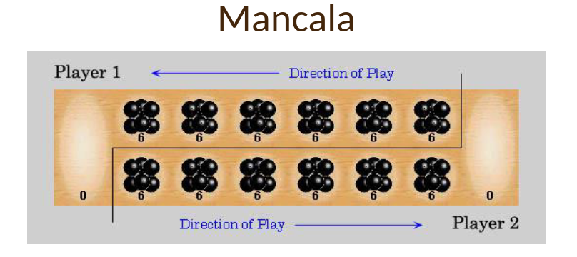
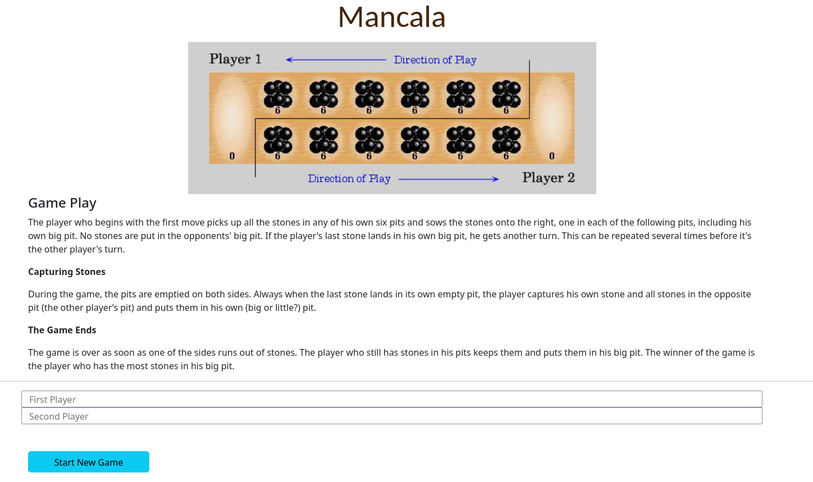
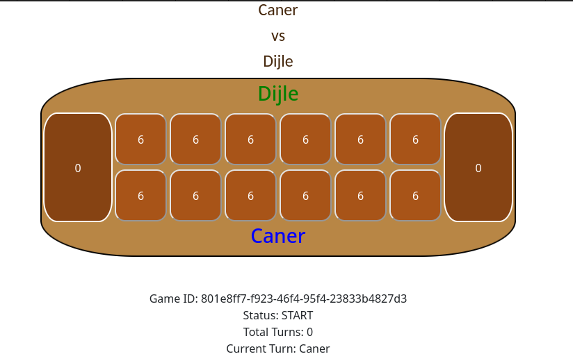

# The bol.com Game

This project is coded as a technical assignment for bol.com 

## Game Play
  

# Board Setup
Each of the two players has his six pits in front of him. To the right of the six pits,
each player has a larger pit. At the start of the game, there are six stones in each
of the six round pits .

## Rules

# Game Play
The player who begins with the first move picks up all the stones in any of his
own six pits, and sows the stones on to the right, one in each of the following
pits, including his own big pit. No stones are put in the opponents' big pit. If the
player's last stone lands in his own big pit, he gets another turn. This can be
repeated several times before it's the other player's turn.

# Capturing Stones
During the game the pits are emptied on both sides. Always when the last stone
lands in an own empty pit, the player captures his own stone and all stones in the
opposite pit (the other player’s pit) and puts them in his own (big or little?) pit.

#The Game Ends

The game is over as soon as one of the sides runs out of stones. The player who
still has stones in his pits keeps them and puts them in his big pit. The winner of
the game is the player who has the most stones in his big pit.
You can also find some visual explanations of the game rules by running a
Google Search for Mancala or Kalaha game.

### Web App

This application welcomes user with an introduction page and two player name inputs. 

When the player clicks  **Start New Game** button a new game with a unique UUID starts. 

When one of the players clean either side of the boards, the game ends.
Seeds left on the houses will be added to the players' stores respectively to calculate final scores 
and determine the winner. 

### Technologies
- Java 18
- Spring Boot
- Thymeleaf 
- Aspectj / Spring AOP
- SpringDoc OpenAPI
- -Swagger-ui
- Diffblue
- - JUnit 5
- Lombok

### Tests
Tests are produced by the Diffblue.

> It was fun to work on this assignment.  
